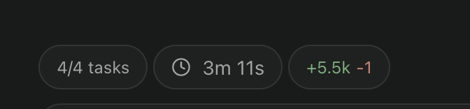
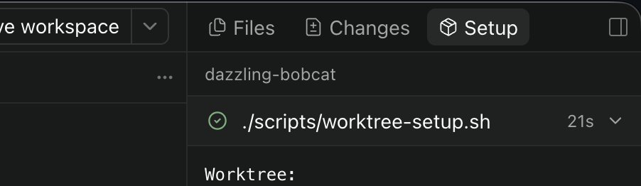

# Paseo plugins

Three plugins for [Paseo](https://paseo.sh) 0.7. Each plugin lives in its own directory and can be installed independently.

| Plugin | What it adds |
| --- | --- |
| [time-since](time-since/README.md) | Elapsed time since the last chat message, shown above the composer. |
| [setup-monitor](setup-monitor/README.md) | Live worktree setup progress and logs in Explorer. |
| [workspace-links](workspace-links/README.md) | Quick access to workspace URLs from a JSON file. |

## Install

Use Paseo 0.7.x and turn on **Settings → Plugins → Enable plugins** on the Paseo daemon host. Run the install command below for each plugin you want.

Plugin code is trusted and unsandboxed. Server code runs as the daemon user. Client code runs inside Paseo.

## time-since

Composer pill that ticks elapsed time since the last chat message in the agent thread. It sits in the track above the composer.

Shows `4m 12s` for the first five minutes, then `12m` / `4h 12m` with no seconds. Hidden while a turn is running. Press the pill for the absolute timestamp.

Open **Time Since Options** in Command Center to customize the clock icon and optional `ago` suffix. See the [plugin README](time-since/README.md) for details.



```bash
paseo plugin add stevecastaneda/paseo-plugins:time-since
```

## setup-monitor

Live view of `worktree.setup` from `paseo.json`. While that script runs, Setup opens in Explorer so the chat tab stays selected. A composer pill shows progress and failure.



```bash
paseo plugin add stevecastaneda/paseo-plugins:setup-monitor
```

## workspace-links

Browser links for each workspace, supplied by `workspace-links.json` at the workspace root. Open the panel from the link-icon composer pill or **Workspace Links** in Command Center. The panel includes setup instructions and an option to hide the pill.

Links open in the default browser on the **machine running the Paseo daemon** (macOS, Windows, or Linux). For remote workspaces, that means the remote host; `localhost` refers to that host too.

See [Workspace Links](workspace-links/README.md) for configuration.

```bash
paseo plugin add stevecastaneda/paseo-plugins:workspace-links
```

## Local development

Start from a checkout of this repository. Each plugin has its own dependencies and scripts; run these commands from the plugin directory. You need npm and a Node.js version that supports `--experimental-strip-types` to run the tests.

```bash
cd time-since   # or setup-monitor or workspace-links
npm install
npm run typecheck
npm test
paseo plugin install "$PWD"
```

After editing the source, rerun the checks and reload the installed plugin:

```bash
npm run typecheck
npm test
paseo plugin reload time-since
```

Replace `time-since` in the reload command with the plugin you are working on. In PowerShell, use `(Get-Location).Path` instead of `"$PWD"` in the install command.
