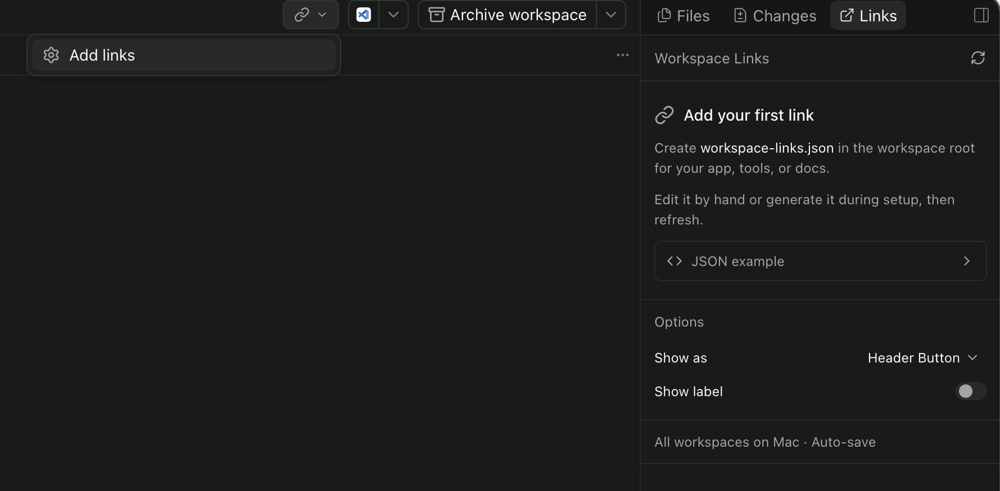

# Paseo plugins

Plugins for [Paseo](https://paseo.sh). Each plugin lives in its own directory and can be installed independently.

| Plugin | What it adds |
| --- | --- |
| [time-since](time-since/README.md) | Elapsed time since the last chat message, shown above the composer. |
| [setup-monitor](setup-monitor/README.md) | Live worktree setup progress and logs in Explorer. |
| [workspace-links](workspace-links/README.md) | Quick access to workspace URLs from a JSON file. |
| [history](history/README.md) | Inspect chat messages, tools, and raw session records from a composer pill. |

## Install

Turn on **Settings → Plugins → Enable plugins** on the Paseo daemon host. Run the install command below for each plugin you want.

Plugin code is trusted and unsandboxed. Server code runs as the daemon user. Client code runs inside Paseo.

## time-since

Composer pill that ticks elapsed time since the last chat message in the agent thread. It sits in the track above the composer.

Shows `4m 12s` for the first five minutes, then `12m` / `4h 12m` with no seconds. Hidden while a turn is running. Press the pill to open a popover with the absolute timestamp.

Open **Time Since Options** in Command Center to customize the clock icon and optional `ago` suffix. See the [plugin README](time-since/README.md) for details.


```bash
paseo plugin add stevecastaneda/paseo-plugins --path time-since
```

## setup-monitor

Live view of `worktree.setup` from `paseo.json`. While that script runs, Setup opens in Explorer so the chat tab stays selected. A composer pill shows progress and failure.


```bash
paseo plugin add stevecastaneda/paseo-plugins --path setup-monitor
```

## workspace-links

Browser links for each workspace, supplied by `workspace-links.json` at the workspace root. The Links composer pill and header button open a menu of those URLs. Choose one to launch it, or **Manage links** for the setup panel. **Workspace Links** in Command Center opens that panel too. The panel still has the setup guide and a control to use the composer pill or a header button. That placement is shared by every workspace on the host and survives restarts.

Links open in the default browser on the **machine running the Paseo daemon** (macOS, Windows, or Linux). For remote workspaces, that means the remote host; `localhost` refers to that host too.

See [Workspace Links](workspace-links/README.md) for configuration.



```bash
paseo plugin add stevecastaneda/paseo-plugins --path workspace-links
```

## Local development

Start from a checkout of this repository. Each plugin has its own dependencies and scripts; run these commands from the plugin directory. You need npm and a Node.js version that supports `--experimental-strip-types` to run the tests.

```bash
cd time-since   # or setup-monitor, workspace-links, or history
npm install
npm run dev
```

`npm run dev` runs the typecheck and tests and stops if either fails. Then it loads this directory into Paseo. If the plugin is already installed from this directory, it reloads it. If it is installed from somewhere else (another checkout, a worktree, or `paseo plugin add`), it removes that install and installs this directory in its place. Either way it takes effect right away, without restarting the Paseo daemon. Run it again after each edit.

The script looks for `paseo` on your `PATH`, then in the macOS app bundle. Switching installs keeps the data a plugin writes to `~/.paseo/plugin-data/`. It clears settings Paseo stores for the plugin in `~/.paseo/plugin-settings/`, which none of the plugins here use.

To go back to your main copy after trying a branch or worktree, run `npm run dev` in the main copy's plugin directory.

## Versioning

Each plugin versions itself in that directory's `package.json`, starting at `0.1.0`. Paseo Cafe uses that field as the update identity, so bump it whenever you ship a change to that plugin. Sibling plugins and the git tag on this repository do not count.

Do not cut a GitHub Release for the whole repo. A plugin update is: increment that plugin's `package.json` (and matching `package-lock.json`), merge to `main`. Cafe's next scan picks it up. `paseo plugin update` still pulls the tracked git branch.
