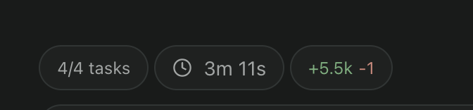
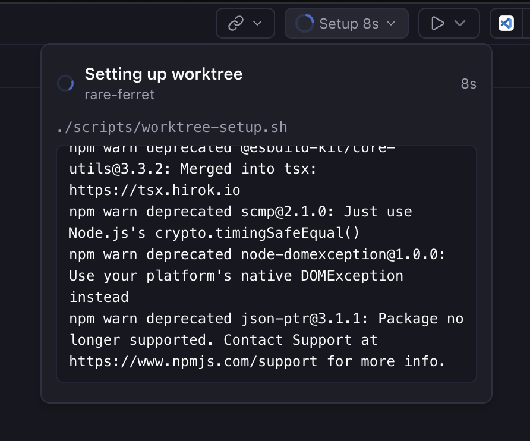
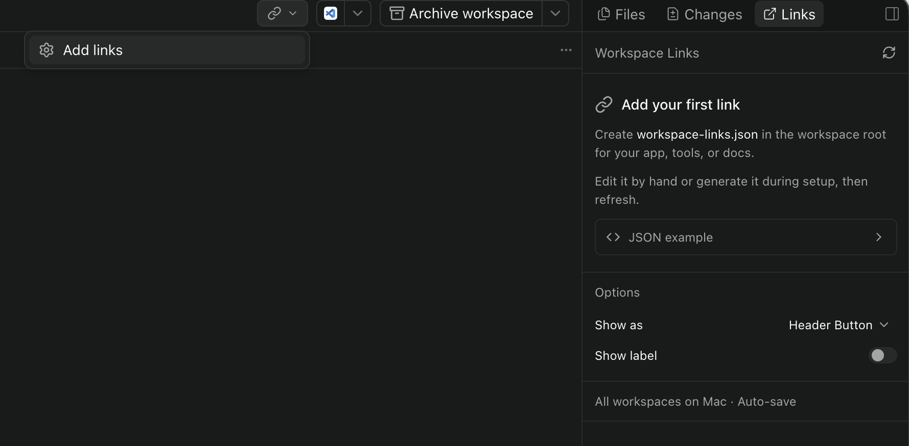

# Paseo plugins

Plugins for [Paseo](https://paseo.sh). Each plugin lives in its own directory and can be installed independently.

| Plugin | What it adds |
| --- | --- |
|  [time-since](time-since/README.md) | Elapsed time since the last chat message, shown above the composer. |
|  [setup-monitor](setup-monitor/README.md) | Live worktree setup progress and logs from a top-bar button. |
|  [workspace-links](workspace-links/README.md) | Quick access to workspace URLs from a JSON file. |
|  [history](history/README.md) | Inspect chat messages, tools, and raw session records from a composer pill. |
|  [progress](progress/README.md) | A live progress dashboard per worktree, drawn from a file agents write with the `paseo-progress` command. |

## Install

Turn on **Settings → Plugins → Enable plugins** on the Paseo daemon host. Run the install command below for each plugin you want. Each plugin is published to npm as `@stevecastaneda/paseo-<plugin>`. Each one is also in Paseo's plugin registry, so `paseo plugin add stevecastaneda/<plugin>` works too.

Plugin code is trusted and unsandboxed. Server code runs as the daemon user. Client code runs inside Paseo.

## time-since

Composer pill that ticks elapsed time since the last chat message in the agent thread. It sits in the track above the composer.

Shows `4m 12s` for the first five minutes, then `12m` / `4h 12m` with no seconds. Hidden while a turn is running. Press the pill to open a popover with the absolute timestamp.

Open **Time Since Options** in Command Center to customize the clock icon and optional `ago` suffix. See the [plugin README](time-since/README.md) for details.



```bash
paseo plugin add npm:@stevecastaneda/paseo-time-since
```

## setup-monitor

Live view of `worktree.setup` from `paseo.json`. A button in the workspace top bar shows a spinner and elapsed time while setup runs, then a check or an alert. Click it for each command's status, duration and log.



```bash
paseo plugin add npm:@stevecastaneda/paseo-setup-monitor
```

## workspace-links

Browser links for each workspace, supplied by `workspace-links.json` at the workspace root. The Links composer pill and header button open a menu of those URLs. Choose one to launch it, or **Manage links** for the setup panel. **Workspace Links** in Command Center opens that panel too. The panel still has the setup guide and a control to use the composer pill or a header button. That placement is shared by every workspace on the host and survives restarts.

Links open on the **device you're using**: your default browser in the desktop app, or the phone's browser in the mobile app. `localhost` refers to that device too.

See [Workspace Links](workspace-links/README.md) for configuration.



```bash
paseo plugin add npm:@stevecastaneda/paseo-workspace-links
```

## history

A composer pill that opens the chat’s saved history: messages, tools, and the raw session records. Supports Codex, Claude Code, and OpenCode. See [History](history/README.md) for details.

```bash
paseo plugin add npm:@stevecastaneda/paseo-history
```

## progress

A live dashboard for long agent jobs, one per worktree. Agents record tickets, stages, questions, deliverables, and activity with the `paseo-progress` command. The **Progress** panel shows percent done, what's stuck, and questions waiting for you, with a button to copy each answer for your reply. A pill above the message box appears when something needs you.

See [Progress](progress/README.md) for the commands and the launcher setup.


```bash
paseo plugin add npm:@stevecastaneda/paseo-progress
```

## Local development

Paseo runs each plugin from one folder on your machine. `npm run dev` makes Paseo run the plugin from the folder you're in. You need Node.js 22.18 or later.

**1. Point Paseo at your copy.** From the plugin's folder in your checkout or worktree:

```bash
cd time-since   # or setup-monitor, workspace-links, history, or progress
npm install     # first time in this copy, and after pulling dependency changes
npm run dev
```

It ends with `time-since: running from <this folder>`. The change is live in the open Paseo app. You don't need to restart anything.

**2. Edit, then run `npm run dev` again.** Each run type-checks and tests the plugin first. If either fails, Paseo keeps running the last version that passed.

**3. Point Paseo back at your main copy when you're done.** Do this before you archive a worktree. If the folder is deleted while Paseo still uses it, the plugin stops loading.

```bash
cd path/to/main/paseo-plugins/time-since
npm install
npm run dev
```

To see which copy Paseo is using, run `paseo plugin ls`. If `paseo` isn't on your `PATH`, use `/Applications/Paseo.app/Contents/Resources/bin/paseo`. `npm run dev` finds it either way.

| Problem | Fix |
| --- | --- |
| `npm run typecheck failed` in a copy you didn't edit | Its dependencies are out of date. Run `npm install`, then `npm run dev` again. |
| Checks pass but the plugin isn't `running` | Run `paseo plugin logs <plugin>` to see why it didn't start. |

Switching copies keeps what a plugin saved in `~/.paseo/plugin-data/`.

## Versioning

Each plugin versions itself in that directory's `package.json`, starting at `0.1.0`. Paseo Cafe uses that field as the update identity, so bump it whenever you ship a change to that plugin. Sibling plugins and the git tag on this repository do not count.

Do not cut a GitHub Release for the whole repo. A plugin update is: increment the version in that plugin's `package.json` and `package-lock.json`, run `npm run check:install` in the plugin's folder, merge to `main`, then run `npm publish` there. Cafe's next scan picks it up. `check:install` packs the plugin and installs it the way Paseo installs from npm, with your npm and with the latest npm. The manifests have no `build` step because Paseo's npm install already brings in each plugin's dependencies. `paseo plugin update` still pulls the tracked git branch.
