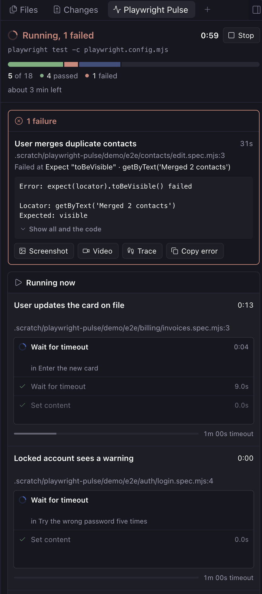
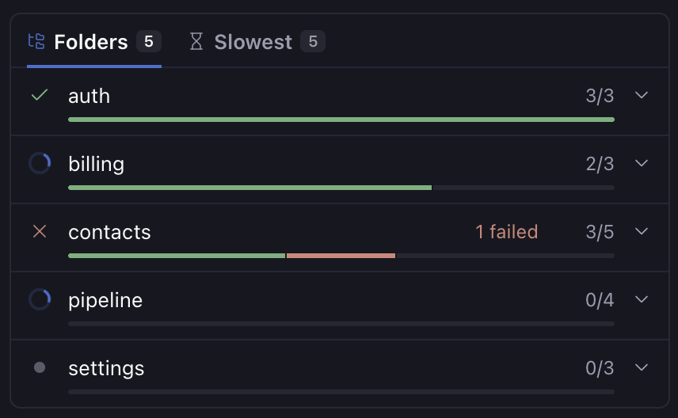
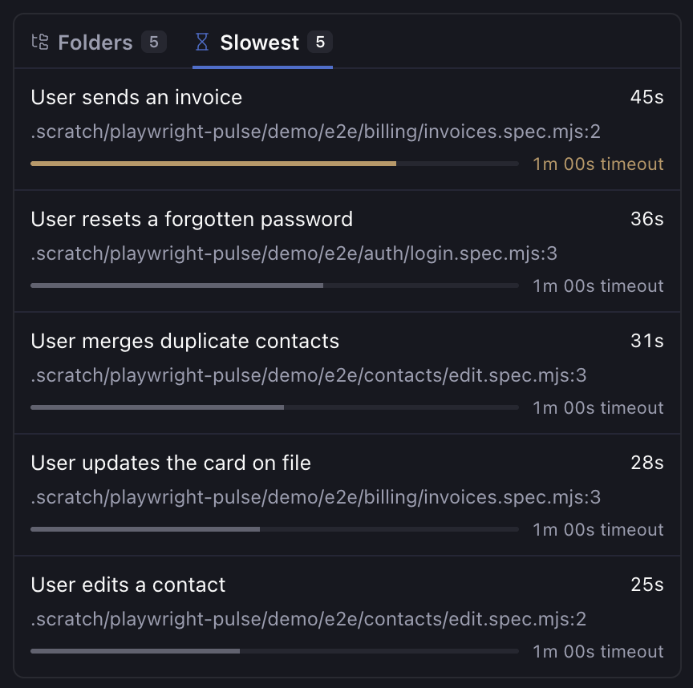

# Playwright Pulse

A live dashboard in Paseo for the Playwright test run in a worktree. You see the run as it happens: the test running now and its current step, how far through the run it is, and each failure with its error, screenshot, video and trace.



 

## What it shows

- **Header pill:** while a workspace's tests run, its header shows a pill with the count so far (`Tests 12/40`, or `1 failed · 12/40` with a red spinner once a test fails). It stays for two minutes after the run ends with the result. Press it to open the panel.
- **Header:** whether the run is starting up, running, passed, failed or interrupted, with a clock, the command that started it, and a progress bar split into passed, failed, skipped and stopped.
- **Stop:** ends a live run the way Ctrl+C in its terminal would: Playwright stops the running test, runs teardown and shuts its web servers. The first press asks to confirm; if the run hasn't ended 8 seconds later, the button offers to force it.
- **Starting up:** while Playwright boots web servers and runs global setup, before the first test.
- **Running now:** one row per worker, each a fixed size so the panel doesn't jump while you read: the test's title and file, its live step (`Click  getByTestId('save')`, inside its `test.step` or hook), the last few steps, and how much of its timeout it has used.
- **Failures:** pinned above the running tests and the rest, with the error, the failing step, the code around it, and buttons to preview the screenshot, open the video, open the trace in Playwright's trace viewer, or copy the error.
- **Time left:** an estimate from the run's pace so far, once a few tests have finished.
- **Folders and Slowest tabs:** one card, two tabs (the same tabs as Progress's history card).
  - **Slowest:** the five longest so far, each against its timeout, amber past three quarters of it.
  - **Folders:** the suite by folder, or **Files** when the specs share one folder, in run order, with how far each has got and what failed, was flaky or was skipped. Folders that haven't started show too. Press one for its tests.

Open it from Explorer, or with **Open Playwright Pulse** in the Command Center.

## Setup

1. Install the plugin:

   ```bash
   paseo plugin add npm:@stevecastaneda/paseo-playwright-pulse
   ```

2. The plugin writes its reporter to `~/.local/share/playwright-pulse/reporter.mjs` when it starts, keeps it up to date, and removes it when it stops (including when you remove the plugin). It never replaces or removes a file it didn't write.

3. Add the reporter to your `playwright.config.ts`, only when that file is the plugin's own and never in CI:

   ```ts
   import { readFileSync } from "node:fs";
   import { homedir } from "node:os";
   import { join } from "node:path";
   import { defineConfig, type ReporterDescription } from "@playwright/test";

   const pulseReporter = join(homedir(), ".local/share/playwright-pulse/reporter.mjs");
   const pulse: ReporterDescription[] = !process.env.CI && isPulseReporter(pulseReporter) ? [[pulseReporter]] : [];

   // Any other file at that path could keep Playwright from starting, so check the plugin's first line.
   function isPulseReporter(path: string): boolean {
     try {
       return readFileSync(path, "utf8").startsWith("// Written by the playwright-pulse Paseo plugin.");
     } catch {
       return false;
     }
   }

   export default defineConfig({
     reporter: [["list"], ...pulse],
   });
   ```

   While Paseo or the plugin isn't running, runs print the list reporter as usual.

4. Run tests without a `--reporter` flag. That flag replaces every reporter in the config, Pulse included. To add one for a single run, use `--add-reporter` instead.

## How it works

The reporter writes a snapshot of the run to `~/.local/state/playwright-pulse/<worktree>-<hash>/runs/<run-id>.json`, outside the repo, so git never sees it, and points `latest.json` beside it at the newest run. The worktree is the nearest folder with `.git` above where Playwright runs. Each new run clears out the files of earlier ones, so a run that starts while another is still going takes over the panel. When the plugin starts it deletes the runs of worktrees that no longer exist.

The reporter is plain JavaScript with no dependencies. It never fails a run: a write that fails is skipped. It writes at most four times a second, and right away when a test or the run ends. A run whose process dies without ending shows as interrupted.

Screenshots preview inside Paseo. Videos open in their default app, and traces in the worktree's own `node_modules/.bin/playwright show-trace`. Only files that the latest run lists, and that sit inside the worktree, can be opened.

Set `PLAYWRIGHT_PULSE=0` to turn the reporter off for one run.

## Requirements

Paseo 0.11 or later and Node.js 22.18 or later on the daemon host. Built and tested with Playwright 1.63.

## Changelog

### 0.1.1

- The list of test runs at the top of Paseo's sidebar is gone, along with the Playwright Pulse Options panel that turned it off. The header pill still shows a workspace's run while it goes. Press it to open the panel.
- The README now has screenshots of the panel and its Folders and Slowest tabs.

### 0.1.0

- First release. Shows a worktree's Playwright run live: the tests running now and their steps, failures with their screenshots, videos and traces, a Stop button, time left, and the run broken down by folder and by the slowest tests.
- A header pill and a list at the top of Paseo's sidebar show runs from any workspace. Press either one to open the panel. **Playwright Pulse Options** turns the sidebar list off.
- Needs Paseo 0.11 or later.
