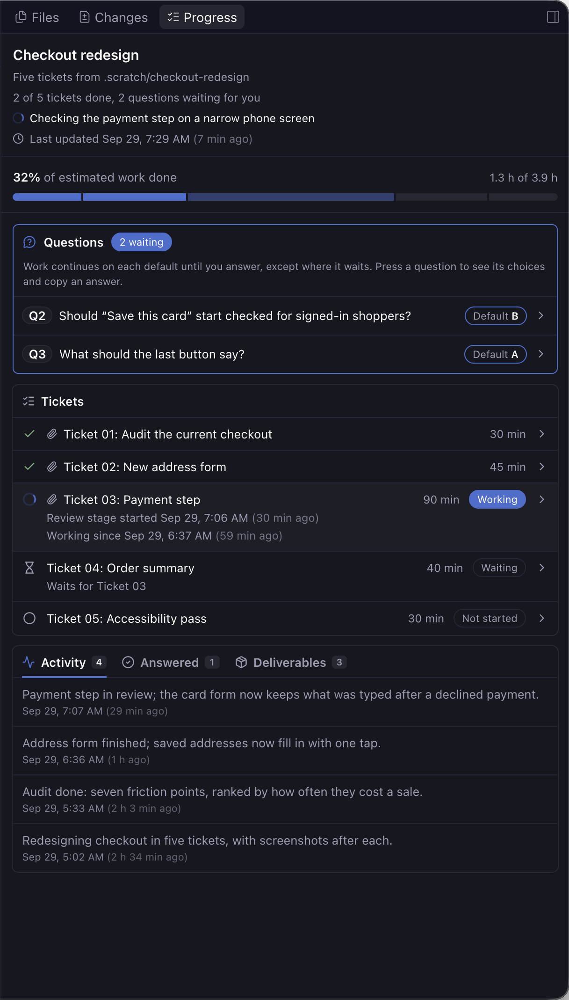

# Progress Dashboard

A Paseo 0.9 plugin that gives each worktree a live progress dashboard. Agents record progress with the `paseo-progress` command, which adds one line per change to `.scratch/progress.jsonl` in the worktree. The **Progress** panel draws the dashboard from that file and updates by itself.



The dashboard shows:

- the run's title, a headline ("2 of 4 tickets done, 5 questions waiting for you, 1 stuck"), a one-line "now" ticker, and when it was last updated
- a "possibly stale" warning after 15 minutes with no update while tickets remain, unless Paseo shows an agent in the workspace still running (for example one waiting on its subagents), and never once every ticket is done or skipped or the run is finished; working items swap their spinner for a pulsing amber warning
- percent of estimated work done, hours done of hours estimated, and a bar with one segment per ticket
- **Stuck:** blocked tickets, tickets running past their estimate, and blockers the agent flags
- **Tickets:** estimate, status, and the working ticket's stage. A ticket that waits for another (`--waits-for T03`) shows an hourglass and "Waits for Ticket 03" until that one is done; waiting is the order of work, so it never counts as stuck, even if the agent also marked it blocked. Press a ticket for its story in a dialog: a timeline of its stages and statuses with how long each took, notes, time worked against the estimate, and the deliverables, questions and activity that belong to it. Items tagged with `--ticket` belong exactly; older, untagged ones are matched by when they happened and marked "by time"
- **Questions:** each with a permanent reference (Q1, Q2, ...), lettered options, and the default the agent is using. Press a question to open it in a dialog, then press **Copy Q2 B** to copy `Q2 (title): B` for your reply. Files and links the agent attached (`--file`) open like deliverables: images and text files preview in Paseo (with **Back** to the question), links open in Paseo's browser, and other files open in their default app. From the pill's popover, the preview opens over the popover, which stays open so you can go back to it. Answers stay listed under the same reference.
- **Activity**, **Answered** questions and **Deliverables** (press one to open it), sharing one card with a tab for each; the panel remembers the tab you picked. Each shows the newest 10, with **Show 10 older** below

The panel lives in Explorer, beside the agent chat, so you can watch both. Open it from Command Center with **Open Progress**. When questions are waiting or something is stuck, a pill above the message box shows it (`3 questions · 1 stuck`). Pressing it opens a popover with each open question, its choices and their Copy buttons, and what is stuck, so you can answer without leaving the chat. **Open Progress** at the bottom opens the panel in Explorer.

The first time a run starts in a worktree whose Progress panel has never been opened, the pill shows a spinner and reads **Progress** instead; pressing it opens the panel. Once the panel has been opened there, the plugin writes an empty `.scratch/progress-panel-opened` and the nudge never comes back, even for later runs. It doesn't open the panel by itself because Paseo switches to a workspace to open its panel, which would pull you away from whatever you're looking at.

## Install

```sh
paseo plugin add stevecastaneda/paseo-plugins --path progress-dashboard
```

Enable plugins under **Settings → Plugins** on the Paseo host. You need Node.js 22.18 or later on the daemon host.

Then install the `paseo-progress` command agents run. Open **Progress** from Command Center and press **Install command** in the banner. It adds one file, `~/.local/bin/paseo-progress`, on the machine running the Paseo daemon, and the banner disappears once agents can run it. The plugin writes nothing until you press it, and it never replaces a file something else put at that path.

To install from a terminal instead, or to put the command somewhere else:

```sh
node "$(paseo plugin ls progress-dashboard --json | node -pe 'JSON.parse(require("fs").readFileSync(0))[0].path')/server/cli.ts" install-launcher [path]
```

If `paseo` isn't on your `PATH`, use `/Applications/Paseo.app/Contents/Resources/bin/paseo`. The command doesn't name a plugin folder: each run asks Paseo (`paseo plugin ls`) which copy of the plugin it is running and runs that copy, so it keeps working after updates and `npm run dev` switches.

Add `.scratch/` to the repository's `.gitignore` so the progress file is never committed.

## Agent skill

The plugin ships an agent skill, `paseo-progress`, that tells agents when to run each command during a multi-ticket job: set up the run, move tickets through their stages, ask questions without stopping, flag stuck work, and finish. Press **Install skill** in the Progress panel. It links `paseo-progress` into `~/.agents/skills`, `~/.claude/skills`, and `~/.codex/skills` (the folders Paseo installs its own skills into), pointing at the copy of the plugin Paseo runs, so plugin updates reach agents. If Paseo later runs the plugin from somewhere else, the button changes to **Update skill**. It never replaces a skill it didn't link; that folder is skipped.

From a terminal instead:

```sh
skill="$(paseo plugin ls progress-dashboard --json | node -pe 'JSON.parse(require("fs").readFileSync(0))[0].path')/skills/paseo-progress"
for dir in ~/.agents/skills ~/.claude/skills ~/.codex/skills; do mkdir -p "$dir" && ln -s "$skill" "$dir/paseo-progress"; done
```

## Recording progress

Run `paseo-progress --help` for every command, and `paseo-progress <command> --help` for one. Commands find the worktree root from the current directory.

```sh
paseo-progress start "Loan Options snapshots" --subtitle "4 tickets"
paseo-progress ticket add "Ticket 01: Saved table" --estimate 120      # Added T01
paseo-progress ticket update T01 --status working --stage Build
paseo-progress ticket update T01 --stage Fixes
paseo-progress ticket update T01 --status done
paseo-progress question ask "Row spacing" "Even out the card spacing?" \
  --option "A=Even it out | Cards look balanced" \
  --option "B=Leave it | No change" \
  --default B --raised-by "Ticket 01 design review"                     # Asked Q1
paseo-progress question answer Q1 A --words "Even it out."
paseo-progress deliverable add "Browser check screenshots" .scratch/shots/ --ticket T01
paseo-progress activity add "Saved table matches the design now." --ticket T01
paseo-progress ticker set "Running the browser check"
paseo-progress stuck set "Staging is down" --ticket T01                 # Flagged S1
paseo-progress show
paseo-progress finish "Snapshots ship for all four tables"
```

- Statuses are `not_started`, `working`, `blocked`, `done`, and `skipped`. Skipped tickets leave the totals.
- A working ticket is stuck once it runs past its estimate, timed from when it started working.
- `question ask --waits` marks a question the agent won't act on until you answer. Its default shows in amber.
- Deliverable paths are stored relative to the worktree root. Web links open in Paseo's browser. Pressing an image (PNG, JPEG, GIF, WebP, up to 10 MB) or text deliverable (Markdown, text, logs, JSON, YAML, CSV; the first 256 KB) previews it in a dialog inside Paseo, which also works from a phone; **Open** there opens the file in its default app. Pressing any other local deliverable opens it with its default app on the machine running the Paseo daemon (for example HTML in your browser and folders in the file manager). On macOS, **Open** sends text files to your default browser. Only recorded deliverables inside the worktree open this way; otherwise the path is copied. The copy icon on each row copies the path.
- `start` begins a fresh dashboard. Earlier runs stay in the file. Question references stay unique across runs.
- `finish "<outcome>"` closes the run once every ticket is done or skipped, no question is open, and nothing is flagged stuck; otherwise it says what is left. The run stays on the dashboard, marked Finished with its outcome, and takes no more updates, so the next agent in the worktree starts a new run instead of adding to it.

## The progress file

`.scratch/progress.jsonl` holds one JSON event per line, each with a version (`v`), a UTC timestamp (`ts`) from the real clock, and a `type`. It is only ever appended to, so you can read or diff the history. A half-written last line is ignored. Other bad lines are skipped and listed in a small notice in the panel while the rest still renders. A lock keeps two commands from writing at once or handing out the same id.

## Limitations

- Nothing updates unless the agent runs `paseo-progress`. Agents need the skill, and an agent that skips the command leaves the dashboard behind.
- The command runs on the machine that hosts the Paseo daemon, and it needs Node.js 22.18 or later there.
- Each worktree keeps its own dashboard in `.scratch/progress.jsonl`. There's no view across worktrees.
- Paseo can't open a panel without switching you to its workspace. So a new run shows a "Progress" pill, and you open the panel yourself.
- Pills check busy worktrees every 5 seconds and quiet ones every 30. In a quiet worktree, a new question can take up to half a minute to show.
- Previews cover images up to 10 MB and the first 256 KB of a text file. Other files open in their default app.
- Stale warnings and overdue times use the daemon host's clock.

## Local development

```sh
cd progress-dashboard
npm install
npm run dev
```

`npm run dev` type-checks and tests the plugin, then points Paseo at this folder. The tests run the agent's commands in a throwaway worktree and read back the dashboard the panel would get.
